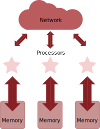

> ## Terminology
>
> Hardware 
> - **CPU** = Central Processing Unit
> - **Core** = Processor = PE (Processing Element)
> - **Socket** = Physical slot to fit one CPU.
> - **Node** = In a computer network typically refers to a host computer.
> 
> Software
> - **Process** (Linux) or **Task** (IBM)
> - **MPI** = Message Passing Interface
> - **Thread** = some code / unit of work that can be scheduled
> - **OpenMP** = (Open Multi-Processing) standard for shared memory programming
> - User Threads = tasks * (threads per task)
>
{: .checklist}

A **CPU** is a computer's Central Processing Unit that is in charge of executing the instructions of a program. Modern **CPUs** contain multiple **cores** that are physical independent execution units capable of running one program thread. **CPUs** are attached to a computer's motherboard via a **socket** and high-end motherboards can fit multiple **CPUs** using multiple sockets. A group of computers (hosts) linked together in a network conform a cluster in which each individual computer is referred as a **node**. Clusters are typically housed in server rooms, as is the case for Hawk supercomputer located at the Redwood Building in Cardiff University.

{: height="50%" width="50%"}

## Why go parallel?
Over time the number of cores per socket have increased considerably, making parallel work on a single computer possible and parallel work on multiple computers even more powerful. The following figure shows the change in market share of number of Cores per Socket as a function of time. In the early 2000's it was more common for systems to have a single core per socket and just a few offered a dual core option. Fast forward to late 2019 and the landscape has changed a lot with several options now available. Systems with 20 cores per socket represented 35% of the market (as with Hawk's Skylake CPUs) while systems with 32 cores per socket represented only 1.2% (as with Hawk's AMD Epyc Rome CPUs). Will this trend continue? It is likely, and therefore, it is worth investing in learning how parallel software works and what parallelization techniques are available.

{: height="50%" width="50%"}

## Single computers

{: height="50%" width="50%"}

A Central Processing Unit, or **CPU**, is a piece of hardware that enables your computer to interact with all of the applications and programs installed in a computer. It interprets the program’s instructions and creates the output that you interface with when you’re using a computer. A computer **CPU** has direct access to the computer's memory to read and write data necessary during the software execution.

As CPUs have become more powerful, they have allowed to develop applications with more features and capable of handling more demanding tasks, while users have become accustomed to expecting a nearly instantaneous response from heavy multitasking environments. 

## Make it go faster

When we talk about a computer's speed, we typically are referring to its performance when interacting with applications. There are three main factors that can impact a computer's performance:

- Increase **clock speed** : Clock speed refer to the number of instructions your computer can process each second and is typically measured in GHz, with current gaming desktop computers in the order of 3.5 to 4 GHz.

-  Increase the **number of CPUs** : Ideally, we would like to have the best of both worlds, as many processors as possible with clock speed as high as possible, however, this quickly becomes expensive and limiting due to higher energy demand and cooling requirements.

- Available **vector instructions**: Modern **CPUs** are equipped with the capacity to apply the same instruction to multiple data points simultaneously, this is known as **SIMD** instructions.

> ## Did you know?
>
> Hawk has two types of **CPUs** available:
> - Xeon Gold 6148 (Skylake) at 2.4GHz clock speed, 20 **cores** per node and support for AVX512 instructions.
> - AMD Epyc Rome 7502 at 2.5 GHz clock speed, 32 **cores** per node and support for AVX256 instructions. 
> 
> Find out more here: [SCW Portal](https://portal.supercomputing.wales/index.php/about-hawk/)
>
{: .callout}

## Parallel computers

{: height="50%" width="50%"}

Since Intel Pentium 4 back in 2004, which was a single core **CPU**, computers have gradually increased the number of cores available per **CPU**. This trend is pushed forward by two main factors: 1) a physical limit to the number of transistors that can be fit in a single core, 2) the speed at which these transistors can change state (on/off) and the related energy consumption.

Reducing a CPU clock speed reduces the power consumption, but also its processing capacity. However, since the relation of clock speed to power consumption is not linear, effective gains can be achieved by adding multiple low clock speed CPUs.

Although CPU developers continue working towards increasing CPU clock speeds by engineering, for example, new transistor geometries, the way forward to achieve optimal performance is to learn to divide computations over multiple cores, and for this purpose we could keep in mind a couple of old sayings:

> "Many hands make light work"
{: .quotation}

> "Too many cooks spoil the broth"
{: .quotation}

> ## Amdahl's Law
>
> Amdahl's Law places a strict limit on the speedup that can be realized by using multiple processors. For example time
> using 'n' processors is `t_n` and fraction of code that is parallel, `f_p`, and fraction of code that is serial, `f_s`
> can be shown to be:
> ~~~
> t_n = ( (f_p / n ) + f_s ) × t_1
> ~~~
> {: .source}
>
> This can be rearranged to give relative speedup
> ~~~
> 1 / ( (f_p / n ) + f_s )
> ~~~
> {: .source}
> 
> What is the limit if code is 100% parallel? What happens if you throw infinite number of processors at a problem with
> non-zero serial fraction of code.?
> > ## Solution
> >
> > - If `f_s` is zero then speedup is equal to number of processors `n`
> > - If `n` approaches infinity, speedup is `1/f_s`. If only 1% of code is serial, you cannot get speedup of more than
> >   100.
> {: .solution}
{: .challenge}

> ## Thinking about programming
>
> - Decompose the problem
>   - Divide the algorithm (car production line) - Breaking a task into steps performed by different processor units. 
>   - Divide the data (call centre) - If well defined operations need to be applied on independent pieces of data.
> - Distribute the parts 
>   - work in parallel
> - Considerations
>   - Synchronisation
>   - Communicate between processor
> - Hardware issues
>   - What is the architecture being used?
>
{: .callout}

## Shared memory

{: height="50%" width="50%"}

As the name suggests, shared memory is a kind of physical memory that can be accessed by all the processors in a multi CPU computer. This allows multiple processors to work independently sharing the same memory resources with any changes made by one processor being visible to all other processors in the computer. 

OpenMP is an API (Application Programming Interface) that allows shared memory to be easily programmed. With OpenMP we can split the work of the calculation by dividing the work up among available processors. However, we need to be careful as to how memory is accessed to avoid potential race conditions (e.g. one processor changing a memory location before another has finished reading it).

## Distributed memory

{: height="50%" width="50%"}

In comparison with shared memory systems, distributed memory systems require network communication to connect memory resources in independent computers. In this model each processor runs its own copy of the program and only has direct access to its private data which is typically a subset of the global data. If the program requires data to be communicated across processes this is handled by a *Message Passing Interface* in which, for example, one processor sends a message to another processor to let it know it requires data in its domain. This requires a synchronization step to allow all processors send and receive messages and to prepare data accordingly.

## How it works?

A typical application is to parallelize matrix and vector operations. Consider the following example in which a loop is used to perform vector addition and multiplication. This loop can be easily split across two or more processors since each iteration is independent of the others.

~~~
DO i = 1, size
  E(i) = A(i) + B(i)
  F(i) = C(i) * D(i)
END DO
~~~
{: .source}

Consider the following figure. In a shared memory system all processors have access to a vector's elements and any modifications are readily available to all other processors, while in a distributed memory system, a vector elements would be decomposed (*data parallelism*). Each processor can handle a subset of the overall vector data. If there are no dependencies as in the previous example, parallelization is straightforward. Careful consideration is required to solve any dependencies, e.g. A(i) = B(i-1) + B (i+1).

{: height="50%" width="50%"}

## Approaches to decomposition

The approach to decomposition sets the model for the whole code since it will decide how and when communication is
performed.  Try to minimise dependencies between decomposed regions, try and make the load balanced, and change
decomposition depending on problem.

Once the decision has been made to decompose, writing the code to communicate when needed (either gathering or
distributing data).  For example, in a weather and climate model you may have haloes of data from neighbouring
processors to keep a snapshot of data you may need. If data is changed in regions other processors may have the data in
a halo an exchange of haloes may need to take place.

When communicating, the edge points need special attention.  For a weather and climate model this may mean the polar
regions on a latitude/longitude grid need special attention.

> ## Communication!!!
> Efficient communication is key to reducing network traffic and using the performance on the local machine as much as
> possible.
{: .callout}

For example, an equation may be the following

~~~
new(i,j) = 0.5 * ( old(i-1,j) + old(i+1,j) )
~~~
{: .source}

If we were to split in the i direction, it would lead to commuication.  In the j direction it would require no
communication.

## The balancing act

In practice, highly optimized software tends to use a mixture of distributed and shared memory parallelism called “hybrid” where the application processes use shared memory within the node and distributed memory across the network.

The challenge is to balance the load across the nodes and processors giving enough work to everyone. The aim is to keep all tasks busy all the time since an idle processor is a waste of resources.

Load imbalances can be caused, for example:
- by array dimensions not being equally divided. Compilers can address these issues through optimization flags, that allow, for example, to collapse loops, changing a matrix A(m,n) to a vector A(n\*m) that is easier to distribute.
- Different calculations for different points – e.g. different governing equations applied to sea or land points on a weather forecasting model.
- The amount of work each processor need to do cannot be predicted - e.g. in adaptive grid methods where some tasks may need to refine or coarse their mesh and others don't.

## Granularity
Granularity refers in parallel computing to the ratio between communication and computation, periods of computation are separated by periods of communication (e.g. synchronization events).

There are two types of approaches when dealing with load balancing and granularity parallelization:
- *"Fine-grain"* - where many small workloads are done between communication events. Small chunks of work are easier to distribute and thus help with load-balancing, but the relatively high number of communication events cause an overhead that gets worse as number of processors increase.

- *"Coarse-grain"* - where large chunks of workload are performed between communications. It is more difficult to load-balance but reduces the communication overhead

Which is best depend on the type of problem (algorithm) and hardware specifications but in general a "Coarse-grain" approach due to its relatively low communication overhead is considered to have the best scalability.

> ## Steps to parallel code
>
> - Familiarize with the code and identify parts which can be parallelized
>   - This typically requires high degree of understanding
> - Decompose the problem
>   - Functional (shared) or data (distributed), or both
> - Code development
>   - Choose a model to concentrate on
>   - Data dependencies
>   - Divide code where for task or communication control
> - Compile, Test, Debug, Optimize
>
{: .checklist}



