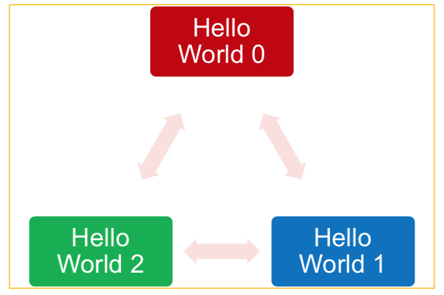

## A brief history

The idea of message passing evolved in the 1980s where supercomputers were domincated by Cray.  Due to dependency on
Cray and competition was difficult this required new approaches to supercomputing.  Message passing was born out of a
desire to link competing technologies.  Cray has realised many cheaper commodity processors could be linked together
cheaper than fewer expensive vector processors.  To make sure code was portable between systems, assurances were made to
make this possible hence MPI was formed.

MPI forum was formed in 1992 with first standard in 1994, available in C and Fortran.  Easiest approach was to
decompose data for processors to work on the same problem (but different views).  Works within processors on a node and
across a network.  Limited only by *Amdahl's Law*.

MPI standard is **large**, but the good news is many programs only use a small subset.  There are many sophisticated
functions available.  The design of MPI makes no assumptions on underlying hardware so work with homogenous and
heterogeneuos systems, that is to say it is hardware vendor neutral.

> ## ECMWF weather and climate model IFS
>
> A well respected weather and climate model called IFS, developed by the European Centre for Medium-range Weather
> Forecasting, [ECMWF](https://www.ecmwf.int), only required approximately 10 MPI calls.
{: .callout}

## Preliminary information

The examples are written in Python using the [**mpi4py**](http://mpi4py.readthedocs.io) module.  This should be easily
translated into other languages. The web can be used for information.

> ## Data models
>
> - **SPMD** - Single Program Multiple Data is usually the recommended approach.
>   - One program executes mutliple times.
>   - Problem divided using the same executable code.
>
> - **MPMD** - Multiple Prgram Multiple Data can be trickier to master.
>   - Different executables used to communicate
>   - Useful to couple different models that would contain completely different appraoches such as ocean and atmosphere
>    modelling.
>   - Available in MPI version 2.0
{: .callout}

> ## Definitions
>
> - Task
>   - One running instance of program
>   - Basic unit of MPI parallel code
> - Leader
>   - The first task in the set of parallel tasks
>   - Given id of zero
> - Follower
>   - All other tasks in the program.
>   - No real difference other than usually leader can interact easily with system, such as I/O.
{: .callout}

## Hello World!

The following command executes a 3 MPI tasks.

~~~
$ mpirun -np 3 hello_world
~~~
{: .language-bash}

A hello world progrm may be written as

~~~
#!/bin/env python
#
# Hello World MPI

from mpi4py import MPI # Python MPI library
import sys

if __name__ == "__main__":
# What rank process is this?
    try:
        comm = MPI.COMM_WORLD # Initiate communications
        rank = comm.Get_rank()
        size = comm.Get_size()
    except Exception as err:
        sys.exit("Error: %s" % err)
    # Say hello
    print(f"Hello World from process: {rank} of {size}")
~~~
{: .language-python}

Then run in SLURM with:

~~~
#!/bin/bash --login
#SBATCH -p compute
#SBATCH --account=scw1148
#SBATCH --ntasks=3
#SBATCH --tasks-per-node=3
#SBATCH -o HelloPython.out

# Load required modules. module purge
module load python
module load mpi
# Run 4 (mpirun knows SLURM variables) copies of the code
mpirun python3 hello_parallel.py
~~~
{: .language-bash}

## Initialisation and identification

The MPI standard defines the following.

- **`MPI_init` and `MPI_init_thread`** - initialises MPI environment.  Required by MPI standard.
- **`MPI_COMM_WORLD`** - a provided communicator that allows all processors to "talk" to all others.
- **`MPI_comm_size`** - a function that returns the total number of processors in communicator.
- **`MPI_comm_rank`** - a function that returns the id of the current exectuable within the communicator.
- **`MPI_finalize`** - a function that shuts down MPI communications - the counterpart to **`MPI_init`**.

In Python these are used behind the scenes to perform similar functionality but in a Pythonic manner.  For example
at import time the `MPI_init_thread` is called. At exit `MPI_finalize` is called automatically. The `MPI_comm_rank` and
`MPI_comm_size` functions are called in the `mpi4py` communicator methods `Get_rank` and `Get_size`.

## The MPI Python module

- **mpi4py** is the top-level package.
  - provides package **MPI**
  - contains all the MPI constructs and parameters.
  - encapsulates the MPI protocol in wrapper functions to allow passing of python objects not coverred by the MPI
   standard.

> ## Install the package on Hawk
>
> Since this is a Python package, anyone should be able to download and install the package.  How would you go about
> doing this? (Hint: Look at previous [Advanced use of Hawk the Supercomputer](hpc-advanced)
> > ## Solution
> >
> > There is a dependency on MPI so you would need to load the mpi module.  The Python package will already load a
> > compiler.  Check `module list` after loading modules.
> > 
> > To install **mpi4py**:
> > ~~~
> > $ module load python
> > $ module load mpi
> > $ pip3 install --user mpi4py
> > $ python3 -c "import mpi4py"
> > ~~~
> > {: .language-bash}
> {: .solution}
{: .challenge}



